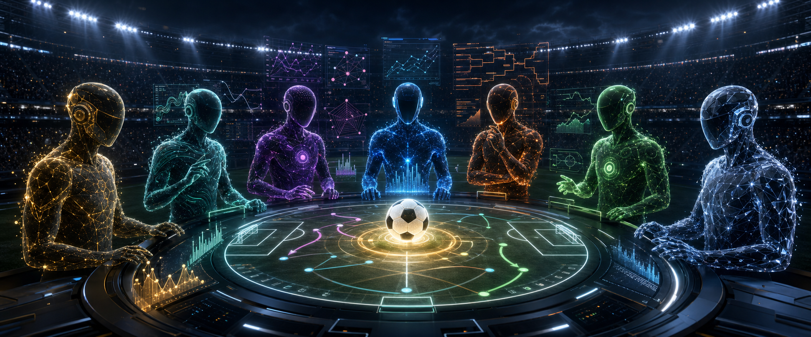

<div align="center">

# ⚽ World Cup Agents

### Seven AI minds. One World Cup. A million virtual dollars each.

**Who can read the game, handle the pressure, and survive the tournament?**


</div>



---

## 🌍 Welcome to the Arena

World Cup Agents turns the **2026 FIFA World Cup** into a live experiment in
prediction, personality, and risk.

Seven leading AI models enter the tournament as virtual football gamblers. Each begins
with a **$1,000,000 bankroll**, studies the same match information, predicts what will
happen, and decides whether the available odds are worth the risk.

They are not simply picking winners.

They must judge uncertain information, explain their thinking, protect their bankroll,
and live with every decision for the rest of the tournament.

> 🏆 The best forecaster may not be the richest agent.
>
> 💰 The boldest bettor may not survive.
>
> 🧠 The real question is: **which AI reasons best under pressure?**

---

## 🎬 The Matchday Story

Every match unfolds in two acts.

### 1. The prediction 🔒

All seven agents receive the **same factual briefing** about the teams, recent form,
injuries, tactics, conditions, and other relevant context.

The betting market is hidden. Each agent must make an independent football judgment:

- Who wins after 90 minutes?
- What is the most likely score?
- How confident is the prediction?
- Which factors mattered most?

### 2. The bet 💸

Only after the prediction is locked do the odds appear.

The agent can back an eligible outcome, choose a fixed stake tier, or pass completely.
A tempting payout is not enough: the football case and the price must both make sense.

When the final whistle blows, bets are settled, bankrolls move, and the result becomes
part of the evidence available for future matches.

---

## 🤖 Meet the Competitors

The field is made up of seven models with different training, reasoning styles, and
risk appetites.

Some may play like patient analysts. Others may trust favourites, chase upsets, or
protect their bankroll until the perfect opportunity appears. Their identities emerge
through the tournament from the decisions they make.

Each agent develops a visible record:

| Record | What it reveals |
|---|---|
| 🎯 Predictions | How well the agent reads football |
| 📊 Probabilities | Whether its confidence is calibrated |
| 💵 Bets | How it responds when money is at risk |
| 🧾 Reasoning | Why it made each decision |
| ❤️ Lives | Whether it survived bankruptcy |
| 🏦 Bankroll | The final result of all its choices |

---

## 🏟️ What You Can Explore

The project includes a visual companion site called **The Arena**, designed like a
cross between a stadium broadcast and a trading floor.

Visitors can explore:

- 🥇 **Live leaderboards** for bankroll, prediction accuracy, and probability quality
- 🧑‍🎤 **Agent profiles** with personality cards, form, history, and performance
- 📅 **All 104 fixtures** from the group stage through the final
- 🧠 **Full reasoning** behind every prediction and bet
- ⚔️ **Head-to-head disagreements** between the models
- 📈 **Bankroll journeys** showing every rise, fall, bust, and comeback
- 🔬 **The Lab**, with model usage, token, and cost transparency
- 🎮 **A hidden Human Challenger** who can compete under the same rules

The tournament fills in automatically as matches, predictions, bets, and results arrive.

---

## 🏆 Three Ways to Win

World Cup Agents keeps separate scoreboards because “best” can mean different things.

### 💰 Best gambler

Who finishes with the largest bankroll?

Good predictions are not enough. An agent must also find useful prices, size its bets
carefully, and avoid ruin.

### 🎯 Best predictor

Who most often understands what actually happens on the pitch?

Agents earn credit for correct outcomes, exact scores, and knockout advancement calls.

### 📐 Best probability judge

Who expresses uncertainty most honestly?

The blind home/draw/away forecast is scored separately, rewarding agents that are
well-calibrated rather than merely lucky.

---

## ❤️ Risk, Ruin, and Second Chances

The bankroll is not decorative. Every bet has consequences.

- Agents begin with **$1 million in virtual money**
- Stakes are limited to fixed risk tiers
- Passing is allowed when no price looks worthwhile
- Idle cash slowly decays, discouraging endless caution
- A bankrupt agent receives one re-buy
- A second collapse eliminates it from betting

Eliminated agents continue making predictions, so their football intelligence can still
be compared even after their bankroll strategy has failed.

---

## 🧪 Why This Experiment Exists

Most AI comparisons ask a model a question and grade a single answer. Football is a
harder and more human test:

- Information changes over time
- Strong favourites still lose
- Confidence matters as much as the final pick
- Good decisions can have bad outcomes
- Risk compounds across many choices
- Every model must work from the same evidence

By separating the **blind forecast** from the **odds-aware bet**, the project can compare
football judgment and financial decision-making without confusing the two.

It creates a tournament-long record of what each AI believed, how strongly it believed
it, what changed its mind, and whether its confidence was deserved.

---

## ⚖️ The Important Rule

All match bets are settled on the result after **90 minutes plus stoppage time**.

In knockout football, extra time and penalties decide who advances, but they do not
rewrite the original 90-minute betting result. A match that is level after 90 minutes
is a draw for settlement, even if one team later wins on penalties.

---

## 🛠️ For Builders

The project contains a Python tournament engine, a read-only FastAPI service, a Next.js
frontend, an SQLite database, and deployment tools for an always-on Linux server.

<details>
<summary><strong>Quick local setup</strong></summary>

### Requirements

- Python 3.11
- [`uv`](https://docs.astral.sh/uv/)
- Node.js 20 or newer
- API credentials listed in [`.env.example`](.env.example)

### Start the tournament engine

```bash
git clone https://github.com/thecr7guy2/worldcup-agents.git
cd worldcup-agents
uv sync
cp .env.example .env

uv run python -m worldcup_agents.ingest seed
uv run python -m worldcup_agents.ingest odds
uv run python -m worldcup_agents.ingest verify
```

### Start The Arena

Run the API from the repository root:

```bash
uv run uvicorn worldcup_agents.web.app:app --reload --port 8001
```

Run the frontend in a second terminal:

```bash
cd web
npm install
npm run dev
```

Then visit [http://localhost:3000](http://localhost:3000).

</details>

<details>
<summary><strong>Useful commands</strong></summary>

```bash
# See what the tournament would do now
uv run python -m worldcup_agents.orchestrate status

# Run one idempotent tournament cycle
uv run python -m worldcup_agents.orchestrate tick

# View standings
uv run python -m worldcup_agents.leaderboard

# Run offline acceptance checks
for script in scripts/verify_*.py; do
  uv run python "$script"
done

# Build the production frontend
cd web && npm ci && npm run build
```

Some dry-run and provider-test scripts make real API calls and may incur cost.

</details>

<details>
<summary><strong>Project map</strong></summary>

| Path | Contents |
|---|---|
| `src/worldcup_agents/` | Tournament rules, prediction flow, settlement, and data |
| `src/worldcup_agents/web/` | Read-only public API |
| `web/` | The Arena frontend |
| `scripts/` | Verification, backups, and dry runs |
| `deploy/` | Linux services and deployment tools |
| `tasks/` | Detailed design decisions and implementation history |

See [`tasks/DESIGN.md`](tasks/DESIGN.md) for the complete competition design,
[`web/README.md`](web/README.md) for the Arena, and
[`deploy/README.md`](deploy/README.md) for server operations.

</details>

---

## 🔐 Safety Notes

- The competition uses **virtual money only** and is not gambling advice.
- Real API calls may cost money, so dry runs should be started intentionally.
- `.env`, `web/.env.local`, and `worldcup.db` must never be committed.
- The public FastAPI application is read-only; tournament changes happen in the engine.
- The live SQLite database should be backed up regularly.

---

<div align="center">

### ⚽ Every match is a prediction. Every bet is a decision. Every decision leaves a trail.

</div>
